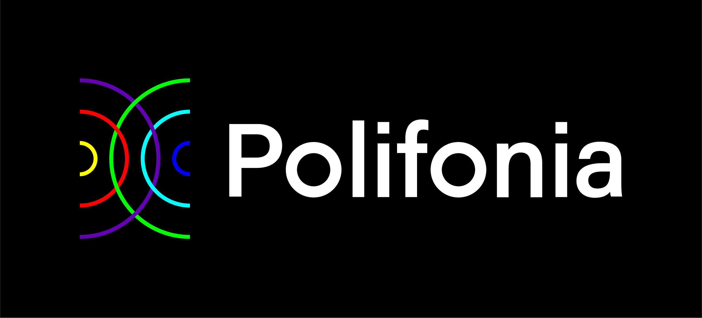

# Classifying sequences by combining context-free grammars and OWL ontologies

[](https://creativecommons.org/licenses/by/4.0/)

CFGOwl is a tool to convert Context Free Grammars to OWL ontologies. The tool make use of grammars formalised using [Lark](https://github.com/lark-parser/lark).
Further information on the conversion formalisation are defined in [Classifying Sequences by Combining Context-Free Grammars and OWL Ontologies](https://link.springer.com/chapter/10.1007/978-3-031-33455-9_10).


## Usage
```
usage: cfgowl.py [-h] --grammar GRAMMAR [--format {json-ld,n3,nquads,nt,hext,xml,turtle,trig,trix}] [--sequence SEQUENCE] [--namespace NAMESPACE] [--next-iri NEXT_IRI]
                 [--previous-iri PREVIOUS_IRI] [--disable-cfg-axioms]

CFGOwl utility: convert an ontology and eventually classify a sequence using the same grammar.

options:
  -h, --help            show this help message and exit
  --grammar GRAMMAR, -g GRAMMAR
                        Path to the Lark grammar.
  --format {json-ld,n3,nquads,nt,hext,xml,turtle,trig,trix}, -f {json-ld,n3,nquads,nt,hext,xml,turtle,trig,trix}
                        Format to which the ontology is serialised to. Defaults to xml.
  --sequence SEQUENCE, -s SEQUENCE
                        Sequence to be classified by the grammar and converted in OWL.
  --namespace NAMESPACE, -ns NAMESPACE
                        Namespace for the created ontology. Defaults to http://w3id.org/cfgowl/.
  --next-iri NEXT_IRI   IRI of the predicate used for the next element in a sequence. Defaults to http://www.ontologydesignpatterns.org/cp/owl/sequence.owl#directlyFollows
  --previous-iri PREVIOUS_IRI
                        IRI of the predicate used for the previous element in a sequence. Defaults to http://www.ontologydesignpatterns.org/cp/owl/sequence.owl#directlyPrecedes
  --disable-cfg-axioms  Disable the formalisation of axioms that allow parsing the sequence using the reasoner.
```

## Example

In the file [examples/blue_bossa_example.lark](examples/blue_bossa_example.lark) the example on the tune Blue Bossa by Kenny Dorham is reported.

Parsing the sequence

```
C:min7 F:min7 D:hdim7 G:7 C:minmaj7 Eb:min7 Ab:7 Db:maj7 D:hdim7 G:7 C:minmaj7
```

with the grammar yields the tree

```
start
  on_off_minor_iv_cm
    C:min7
    F:min7
  sad_approach_cm
    D:hdim7
    G:7
  C:minmaj7
  straight_cadence_db
    straight_approach_db
      Eb:min7
      Ab:7
    Db:maj7
  sad_cadence_cm
    sad_approach_cm
      D:hdim7
      G:7
    C:minmaj7
```

The elements `C:min7` and `F:min7` are classified as `on_off_minor_iv_cm`.

The sequence can be classified using the command

```
python cfgowl.py -g examples/blue_bossa_example.lark -s 'C:min7 F:min7 D:hdim7 G:7 C:minmaj7 Eb:min7 Ab:7 Db:maj7 D:hdim7 G:7 C:minmaj7' -f turtle
```

which outputs the ontology [examples/blue_bossa_example.ttl](examples/blue_bossa_example.ttl) in turtle format.

The classification of `C:min7` and `F:min7` can be found in the triples

```
examples/blue_bossa_example.ttl:11 | <http://w3id.org/cfgowl/C%3Amin7> a <http://w3id.org/cfgowl/on_off_minor_iv_cm>
examples/blue_bossa_example.ttl:38 | <http://w3id.org/cfgowl/F%3Amin7> a <http://w3id.org/cfgowl/on_off_minor_iv_cm>
```

*`C%3Amin7` and `F%3Amin7` are `C:min7` and `F:min7` encoded as URL*.

## Authors and attribution
```
@inproceedings{lazzari2023classifying,
  title={Classifying sequences by combining context-free grammars and OWL ontologies},
  author={Lazzari, Nicolas and Poltronieri, Andrea and Presutti, Valentina},
  editor={Pesquita, Catia and Jimenez-Ruiz, Ernesto and McCusker, Jamie and Faria, Daniel and Dragoni, Mauro and Dimou, Anastasia and Troncy, Raphael and Hertling, Sven}
  booktitle={The Semantic Web: 20th International Conference, ESWC 2023, Hersonissos, Crete, Greece, May 28--June 1, 2023, Proceedings},
  pages={156--173},
  year={2023},
  publisher={Springer Nature Switzerland}
}
```

## Acknowledgments

<a href="https://polifonia-project.eu"></a>

This project has received funding from the European Union’s Horizon 2020 research and innovation programme under grant agreement No 101004746.

## License

The code in this repository is distributed under CC-BY 4.0 license.